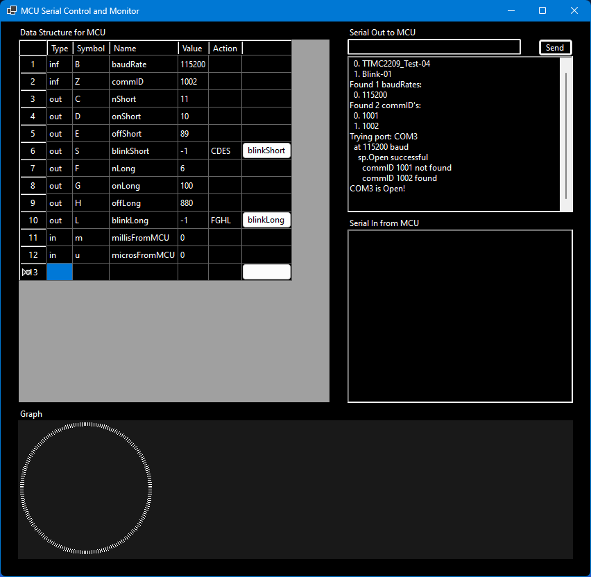

**MCU_Serial_Comm** is a C# program that allows the user to interact with a Microcontroller (MCU) such as an Arduino.  
**Note:** This is my first C# project and I am still learning, any constructive thoughts are very welcome.  
Ctrl+k v

Prerequisites 
- Prior to using this solution, one needs to prepare an MCU with a program designed to interact over a serial conection - see sample Arduino file in repository.
- This solution also needs to read data from an existing "settings.ini" file that contains information about the MCU noted above as well as details on what information is to be shared - see sample "settings.ini" file in repository.
- The MCU must be connected to the Windows computer running this solution, typically via USB. 

Program Overview 
- Opens the settings.ini file and populates arrays with all the section names and associated baud rates and commID's. The baud rate and commID in the settings.ini file need to match those values in the MCU.
- Searches the COM ports of the computer and tries to open them at the baud rates listed and then requests a response from the MCU with the commID.  If matching data is found, it loads the rest of the settings.ini data related to that MCU and opens the port for reading and writing.
- Displays a DataGridView (DGV) control with the data noted above, including buttons in the grid where applicable.  Also displays two RichTextBoxes that log data being sent out to the MCU as well as data received back from the MCU
    - When a button is pressed in the DGV, single letter commands and integer data from the DGV is sent to the MCU.
    - The program also looks for data coming back from the MCU in a format that matches the specification of the .ini file and displays it in the DGV
- The graph area at the bottom of the window is a work in progress and currently has no functionality

Sample Program 
Using the sample settings.ini and Arduino file included, the program exposes two buttons ("blinkShort" and "blinkLong") which each send a series of commands with values to the MCU. pressing the blinkShort button will send the following commands to the MCU:
- C11
- D10
- E89
- S

This series of commands tells the MCU to: set nShort to 11 blinks, set onShort to 11 milliseconds, set offShort to 89 milliseconds and finally run the blinkShort command - executin the 11 blinks of the built in LED.  Then the MCU will watch for incoming values from the MCU prefaced with "m:" and "u:" (see rows 11 and 12 of the DGV).  These values contain thetime in milliseconds and microseconds to execute the entire blinkShort command.

By adding new sections to the settings.ini file and modifying the ProcessIncomingByte() and HandlePreviousState() functions in the Arduino file (Credit to Nick Gammon - http://gammon.com.au/serial for the state engine code used here), users can interact with the MCU in Windows and see data being returned.

Future Work 

- Add a button that will save changed values in the DGV to the settings.ini file
- Add functionality to the "graph" section that will show incoming data from the MCU in some graphical format
